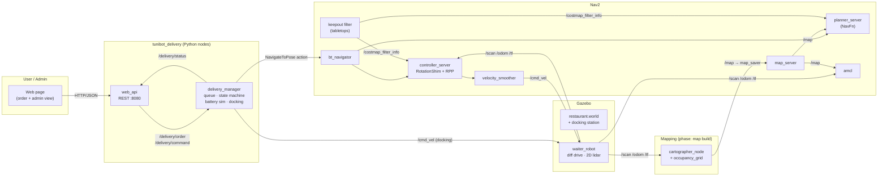
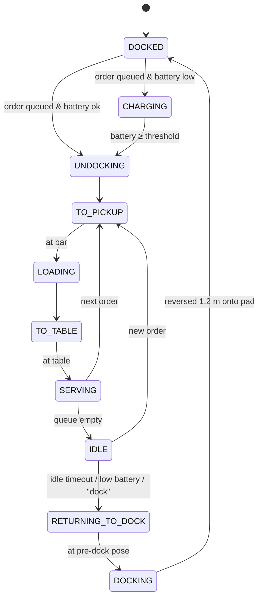

# TuniBot — Autonomous Restaurant Delivery Robot (CSTAM-TUNIBOT)

ROS 2 Humble software stack for a simulated waiter robot ("robot-étagère") that maps
a restaurant, localizes itself, takes food/beverage orders, delivers them to tables
and returns to its charging dock on its own.

| Phase 1 feature | How it is implemented |
|---|---|
| Mapping & localization (SLAM) | Cartographer 2D (`config/cartographer_2d.lua`) for mapping, AMCL on the saved map for localization |
| Autonomous navigation | Nav2: NavFn planner, RotationShim + Regulated Pure Pursuit controller, footprint-aware costmaps, tabletop **keepout filter** |
| Delivery task management | `delivery_manager` node: order queue, bar pickup → table → serve, retries, cancel, status topic |
| Auto-docking | Idle timeout / low battery / operator command → Nav2 to pre-dock pose → odometry-closed-loop straight reverse onto the charging pad |
| UI backend | `web_api` node: REST API + web page (order a delivery, admin view of state, battery, queue) |

## Architecture



### Delivery state machine



## Engineering notes (problems found and fixed)

The first map was unusable (the room appeared several times, rotated, along a 66 m trail).
Root causes and fixes:

1. **Lidar self-occlusion** — the lidar (18 cm high) saw the robot's own rear column 35 cm
   behind it. A feature fixed to the robot makes the scan matcher believe the robot is not
   rotating → rotational drift. Fix: 290° field of view, rear ±35° excluded.
2. **Two wheels, no caster** — the chassis tipped and scraped the floor → wheel slip,
   tilted lidar. Fix: front/rear frictionless caster spheres, wheel friction set.
3. **3.5 m lidar range in a 20 × 20 m room** — most of the room had no feature in view.
   Fix: 12 m range (RPLidar-class sensor) and Cartographer `max_range = 12`.
4. **Dynamic cardboard boxes** were pushed by the robot during mapping. Fix: made static.
5. **No IMU** — Cartographer now tracks `base_footprint` (2D SLAM does not use IMU data),
   so the fake `imu_link` static TF is no longer needed.
6. **Pedestal tables** — the 2D lidar sees only the table column, but the robot (1.1 m tall)
   would hit the 0.91 m tabletop. `scripts/make_keepout_mask.py` builds a Nav2 keepout mask
   from the table poses in the world file; Gazebo models stay unchanged.

## Build

```bash
sudo apt install python3-colcon-common-extensions
cd ~/ros2_ws && colcon build --symlink-install && source install/setup.bash
```

## Run

**1. Build the map (SLAM)** — one terminal each:
```bash
ros2 launch tunibot_delivery sim.launch.py
ros2 launch tunibot_delivery slam.launch.py
ros2 run teleop_twist_keyboard teleop_twist_keyboard --ros-args -p speed:=0.2 -p turn:=0.5
```
Drive one loop around the room, come back to the dock, then:
```bash
ros2 run nav2_map_server map_saver_cli -f ~/ros2_ws/src/tunibot_delivery/maps/restaurant_map --ros-args -p use_sim_time:=true
colcon build --symlink-install --packages-select tunibot_delivery
```

**2. Autonomous delivery** — stop SLAM, keep Gazebo running (robot back on the dock):
```bash
ros2 launch tunibot_delivery navigation.launch.py
ros2 launch tunibot_delivery delivery.launch.py
```
Open http://localhost:8080, choose a table, press **Send robot**. Or from the CLI:
```bash
ros2 topic pub --once /delivery/order std_msgs/String '{data: "{\"table\": \"table_3\", \"items\": \"2 coffees\"}"}'
ros2 topic pub --once /delivery/command std_msgs/String '{data: dock}'
```

## Layout

```
launch/     sim · slam · navigation · delivery
config/     cartographer_2d.lua · nav2_params.yaml · delivery_points.yaml
urdf/       waiter_robot.urdf.xacro
worlds/     restaurant.world (static furniture + docking station)
maps/       restaurant_map.{pgm,yaml} · keepout_mask.{pgm,yaml}
scripts/    make_keepout_mask.py
tunibot_delivery/  delivery_manager.py · web_api.py
web/        index.html
```
